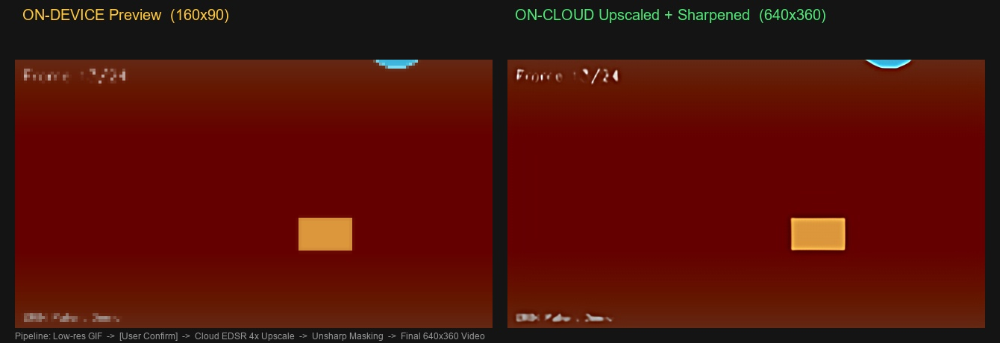

# Hybrid Video Upscaling Pipeline (US20170206632A1)

AI Hybrid Pipeline for Video Super-Resolution
On-Device Preview → Cloud CNN Upscaling → High-Resolution Video

This repository demonstrates a **hybrid video upscaling architecture** inspired by the patent **US20170206632A1**, where a lightweight device generates a preview sequence while computationally intensive super-resolution is executed in the cloud using a **Convolutional Neural Network (CNN)**.

The project simulates a **modern edge-cloud AI pipeline**, commonly used in mobile video processing, cloud rendering, and AI-assisted media generation systems.

---

# Demo Pipeline



Left: Device-generated preview (160×90)
Right: CNN upscaled output (640×360)

---

# Key Idea

Mobile devices often lack the compute resources required for high-quality video super-resolution.

This architecture solves the problem by splitting the workload:

Device responsibilities:

* Generate a **low-resolution preview**
* Allow **user confirmation**
* Send anonymized frames to the cloud

Cloud responsibilities:

* Apply **CNN super-resolution**
* Reconstruct higher-resolution frames
* Return frames for final assembly

This enables **high-quality results with minimal device compute usage**.

---

# Architecture

```
[Device]

Step 1: Low-resolution preview generation (GIF)
      │
      ▼
User confirmation gate
      │
Step 2: Frame preparation + integrity tokens
      │
      ▼

[Cloud Processing]

CNN Super-Resolution
Frame Upscaling
Detail Enhancement
Temporal consistency checks
      │
      ▼

[Device]

Step 4: Frame verification
Step 5: Final video reconstruction
      │
      ▼

High-Resolution Output Video
```

---

# Processing Pipeline

| Step | Location | Description                         |
| ---- | -------- | ----------------------------------- |
| 0    | Input    | Load or generate source frames      |
| 1    | Device   | Generate low-resolution preview GIF |
| 2    | Device   | Prepare frames for cloud processing |
| 3    | Cloud    | CNN super-resolution processing     |
| 4    | Device   | Verify returned frames              |
| 5    | Output   | Assemble final MP4 video            |

---

# Example Outputs

## Device Preview


## Final Output

`step4_final_video.mp4`

---

# Core Technologies

Python
OpenCV
Convolutional Neural Networks (CNN)
Video Frame Processing
Hybrid Edge-Cloud AI Architecture

---

# Installation

Requirements

Python 3.9+
OpenCV
NumPy
Pillow
Requests

Install dependencies:

```
pip uninstall opencv-python -y
pip install opencv-contrib-python pillow numpy requests
```

---

# Running the Demo

Run automatic demo

```
python hybrid_upscaling_demo.py --demo
```

Use your own video

```
python hybrid_upscaling_demo.py --input video.mp4
```

Use an image

```
python hybrid_upscaling_demo.py --input image.jpg
```

---

# Output Files

| File                     | Description                |
| ------------------------ | -------------------------- |
| step1_lowres_preview.gif | Device preview             |
| step2_cloud_frames/      | Frames sent to cloud       |
| step3_upscaled_frames/   | CNN upscaled frames        |
| step4_final_video.mp4    | Final video output         |
| pipeline_comparison.jpg  | Before vs after comparison |

---

# Research Motivation

This prototype explores how **hybrid edge-cloud AI architectures** can improve video processing pipelines by distributing computation across device and cloud infrastructure.

Such systems are increasingly used in:

* AI video generation platforms
* streaming services
* mobile video editing tools
* AR/VR content pipelines
* cloud rendering systems

---

# Repository Structure

```
US20170206632A1-google-CNN
│
├── hybrid_upscaling_demo.py
├── Hybrid_Upscaling_Pipeline_Documentation.docx
│
├── pipeline_comparison.jpg
├── step1_lowres_preview.gif
├── step4_final_video.mp4
│
└── README.md
```

---

# Author

Iqbal Mauludi
AI Systems / Video Processing / Edge-Cloud Architecture
